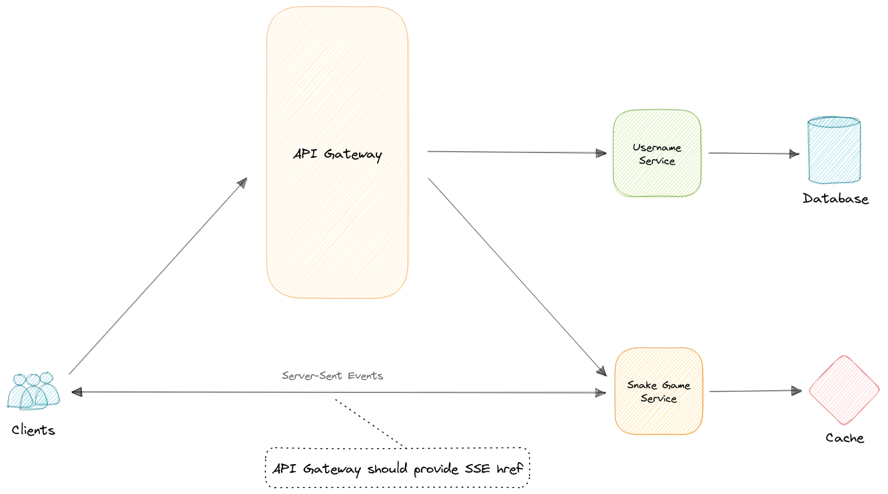

# WorldWideSnake

Note: All of the following service specifications are suggestions at best, and may be modified as seen fit.



## API Gateway

### Register snake

Registers a new snake with a name.
Fails if that snake is already registered.
Returns that snake's name and its authorization token.

**Endpoint**:

```ts
POST /game/snakes
```

**Parameters**:

```ts
{
  name: string,
}
```

**Returns**:
201 CREATED

```ts
{
  name: string,
  token: string,
}
```

### Subscribe for game states

Points to a link which allows listening to game state updates.
Returns a hyperlink reference to a text stream endpoint.
That endpoint then returns an endless text stream of "newState" events.
 
**Endpoint**:

```ts
GET /game/events
```

**Returns**:
200 OK

```ts
{
  href: string,
  method: string,
  type: string,
}
```
Server-Sent Events

```ts
event: newState
data: {
  rows: number,
  cols: number,
  teleporting: boolean,
  snakes: [
    {
      name: string,
      head: {
        x: number,
        y: number,
      },
      tail: [
        {
          x: number,
          y: number,
        },
      ],
      facing: string,
    },
  ],
  foods: [
    {
      x: number,
      y: number,
    },
  ],
}
```

### Redirect snake

Updates the direction to which a snake is facing.
The directions are "NORTH", "SOUTH", "EAST" and "WEST".
Returns that snakes' information after updating.

**Endpoint**:

```ts
PUT /game/snakes/{name}
```

**Parameters**:

```ts
{
  facing: string,
}
```

**Returns**:
200 OK

```ts
{
  name: string,
  head: {
    x: number,
    y: number,
  },
  tail: [
    {
      x: number,
      y: number,
    },
  ],
  facing: string,
}
```

### Unregister snake

Unregisters an existing snake.
Fails if that snake isn't registered.

**Endpoint**:

```ts
DELETE /game/snakes/{name}
```

**Returns**:
204 NO CONTENT

## Username Web Service

### Register username

Registers a new username.
Fails if that username is already registered.
Returns that username and its authorization token.

**Endpoint**:

```ts
POST /usernames
```

**Parameters**:

```ts
{
  username: string,
}
```

**Returns**:
201 CREATED

```ts
{
  username: string,
  token: string,
}
```

### Find username

Finds a username by token.
Fails if that authorizatoin token doesn't map to any username.
Returns that username and its authorization token.

**Endpoint**:

```ts
GET /usernames/{token}
```

**Returns**:
200 OK

```ts
{
  username: string,
  token: string,
}
```

### Unregister username

Unregisters an existing username.
Fails if that username isn't registered.
Fails if that authorization token doesn't map to that username.

**Endpoint**:

```ts
DELETE /usernames/{token}
```

**Returns**:
204 NO CONTENT
